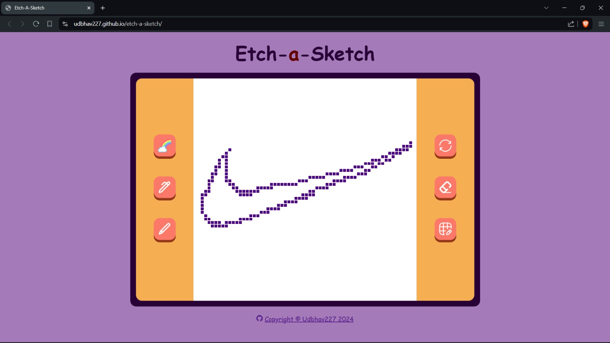

# 🖌️ Etch-a-Sketch

Welcome to the Etch-a-Sketch project! This project was created to practice and demonstrate the use of mouse event listeners in JavaScript.

## 🌐 Website 

You can view the live website here: [udbhav227.github.io/etch-a-sketch](https://udbhav227.github.io/etch-a-sketch)
Note: This website is not responsive and it is not functional in mobile devices.

## 📚 Project Description

This is a simple web-based Etch-a-Sketch application. The project is designed to showcase the following:

- Use of basic HTML fundamentals for structuring the content.
- Use of basic fundamentals CSS for styling and layout.
- Use of basic JavaScript fundamentals for dynamic behavior and interactivity.

## 📝 Features 

- **Interactive Drawing Grid**: Allows users to draw on a grid by draging the mouse.
- **Grid Size Selector**: Users can select the size of the grid.
- **Reset Button**: Clears the drawing and resets the grid.
- **Sketch Mode**: 

## 📸 Screenshots 

## 🛠️ Technologies Used

- HTML5
- CSS3
- JavaScript

## ⚙️ Skills Practiced

- **HTML**: Creating a structured layout for the application using .
- **CSS**: Styling the layout to make the application visually appealing.
- **JavaScript**: Adding interactivity to the application using DOM manipulation and mouse event listeners.

## ⚙️ Icon Credit
- **Icons**: © 2024 · SVG Repo LLC